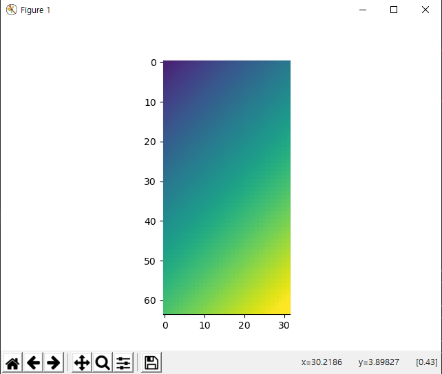

# py_2d_array_animation
This repository provide you 2d animation graph that compose of value given from arudino.

## Quick start

First, upload "./value_generator/value_generator.ino" file to your arduino.

Second, run 'test.py'.
~~~
//* Caution *//

ser  = serial.Serial("COM3", baudrate= 115200, 
            timeout=2.5, 
            parity=serial.PARITY_NONE, 
            bytesize=serial.EIGHTBITS, 
            stopbits=serial.STOPBITS_ONE
            )

// Change "COM3" to your arduino port. "COM3" is just example. :)
            
~~~

Third, watch beautiful graph. 
 
